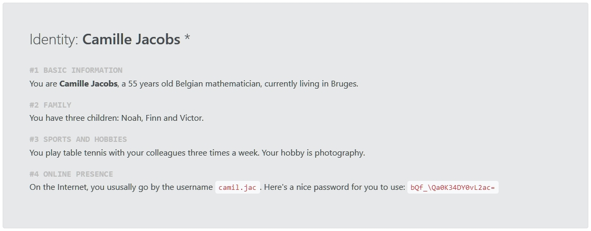
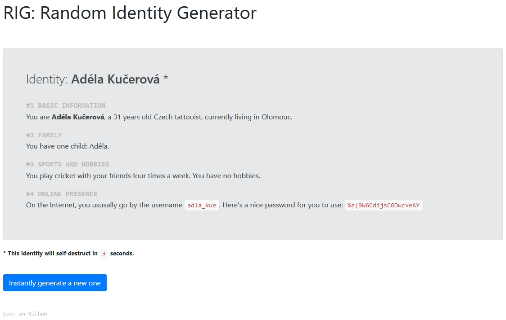

# RIG: Random Identity Generator

A PHP application to generate random European identities. It is so random, that we need a mathematician to calculate the number of possible identites.

Oh, look, we have one\*:

Also, we have a tattoist\*\*:

\* and \*\*: I know, this was unnecessary information, but it was a nice way to introduce the screenshots. Sorry.

### How it works

**Randomized choices (steps) to build the identity:**

1. pick: nationality (34 European nationality at the moment)
2. pick: given name (~20 possibilities for each nationality)
3. pick: surname (~20 possibilities for each nationality)
4. pick: city of residence (~10 possibilities for each nationality)
5. pick: age (anything between 15 and 64)
6. pick: occupation (currently 328 occupations included)
    * identities under 23 are all "students"
    * for identities 23 and above a random occupation is picked
7. pick: number of children
    * identities under 23 don't have kids
    * for identities 23 and above a random number is picked between 0 and 3 as the number of kids
8. pick: names of the children
    * a name is picked for each children from the list of given names for the same nationality
    * this step is ignored if the identity doesn't have kids
9. pick: sports (19 sports included, plus a possibility that identity doesn't do any sports)
10. pick: frequency of doing sports (5 possibilities)
    * this step is ignored if the identity doesn't do any sports
11. pick: companion when doing sports (3 possibilities)
    * this step is ignored if the identity doesn't do any sports
12. pick: number of hobbies (a random number between 0 and 2)
13. pick: hobbies (33 possibilities included)
    * this step is ignored if the identity hasn't got a hobby
14. pick: a username is generated where a separator (`_` or `.`) is or isn't inserted

**Other features:**

* A random, 20-character password is generated for each identity (just for fun).
* Identity self-destructs (the page reloads) after a minute (again, just for fun).
* Button to generate a new identity instantly.

### Third-party stuff

* For password generation, I used [this code](https://stackoverflow.com/a/31107425) (license: CC By-SA 3.0).
* For the nice UI, I used [Bootstrap](http://getbootstrap.com/) (license: MIT).
* For the countdown timer, I used [this code](https://stackoverflow.com/a/1191875) (license: CC By-SA 3.0).
* Most of the data comes from Wikipedia (I've searched *a lot*). Two pages (license: CC By-SA 3.0) that were extremely useful:
    * https://en.wikipedia.org/wiki/List_of_most_popular_given_names and
    * https://en.wikipedia.org/wiki/List_of_most_common_surnames_in_Europe
    
### License

RIG is licensed under the MIT license (except the third-party stuff, as above). See the details in the [LICENSE](LICENSE) file.
